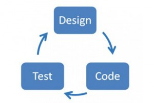

# Was ist TDD

TDD auch Test Driven Development ist eine inkrementelle Strategie in der Software Entwicklung
um über Tests das Software Design zu lenken.

# Vorgehensweise ohne TDD

Design -> Code -> Test
 


# Vorgehensweise mit TDD

Design -> Test -> Code

::: notes

This is my note.

:::

# Missverständnisse zu TDD

- TDD != Unit Tests

# TDD Vorteile

- Baby Steps (divide and conquer)
- Getrennte Phasen = Fokus.
- Der Code wird testbar
- Refactorings sofort = Clean Code
- Man schreibt nur Code der auch wirklich benötigt wird
- Hohe Testabdeckung
- Ist Dokumentation von fachlichen Anforderungen

# TDD Cycle


---

# Cycle

RED: Schreibe einen Test der fehlschlägt.

GREEN: Schreibe sowenig Code wie möglich damit der Test erfolgreich durchläuft.

REFACTOR: Refaktorisiere den Test (DRY, Abstrahieren wo nötig, Clean Code)

# 3 Laws of TDD

1. You are not allowed to write any production code unless it is to make a failing unit test pass

2. You are not allowed to write any more of a unit test than is sufficient to fail; and compilation failures are failures.

3. You are not allowed to write any more production code than is sufficient to pass the one failing unit test.

# Outside In

### Design von aussen nach innen

- Wie möchte ein Nutzer/Entwickler mit dem System interagieren! (API First Prinzip)
- Bestimmung der Kollaboratoren der Top Level Klasse. 
- Fake it until you make it (Mock, feste Werte) 
- Experimente mit den Mocks bis API stabil ist und passt


# Inside Out

# ATDD

---

# Patterns for Test Driven Development


# Testing
## JUNIT 4/5 vorstellen
## Anatomie eines Unit Tests
## Arrange-Act-Assert Pattern

### Arrange 
In diesem Bereich werden alle Vorbedingungen hergestellt.

### Act
Hier wird der zu testende Code/Methode aufgerufen

### Assert
Das erwartet Resultat wird hier verifiziert.

#### Bsp:

#### Klasse

```java
public class Calculator {
    public int sumOf(int augend, int addend) {
      return augend + addend;
    }
}
```

#### Test Klasse

```java
public CalculatorTest {

    @Test
    public should_return_4_when_1_and_3_is_given() {

        // Arrange
        int augend = 1
        int addend = 3

        Calculator sut = new Calculator()

        // Act
        int result = sut.sumOf(augend, addend)

        // Assert
        assertEquals(4, result)
    }

}
```
[Siehe auch: ArrangeActAssert](http://wiki.c2.com/?ArrangeActAssert)


# Best Practices
